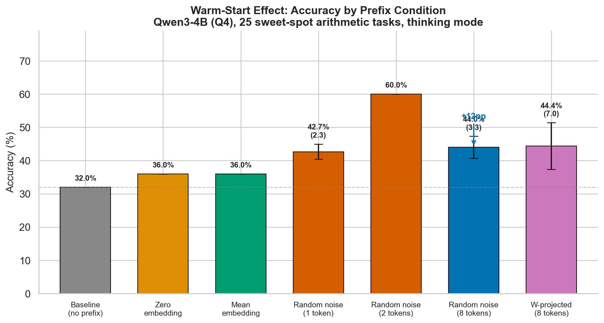
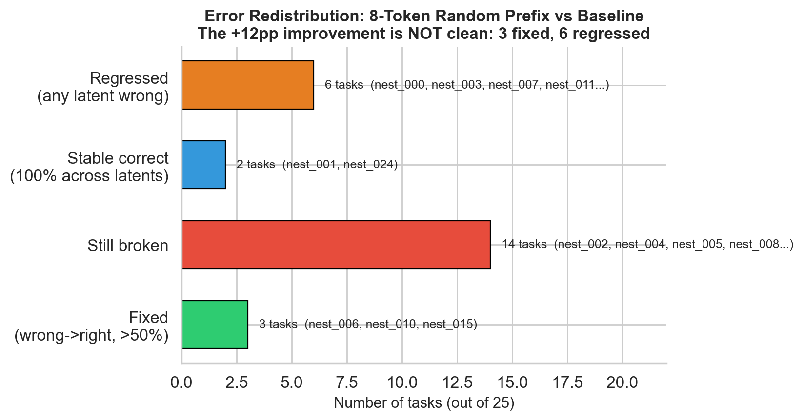
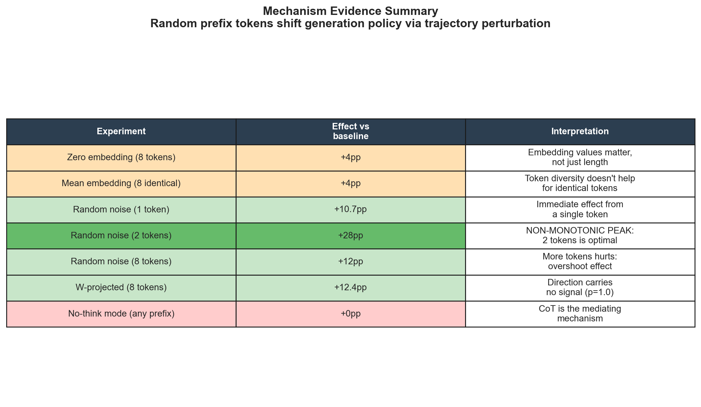
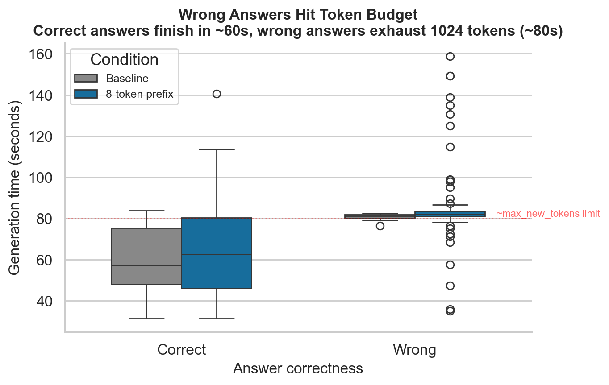
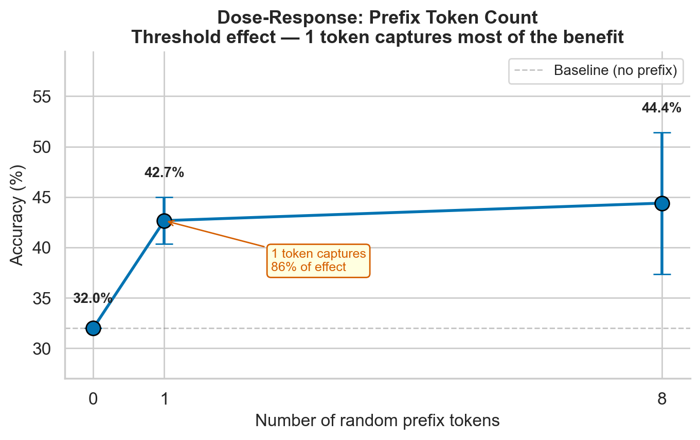
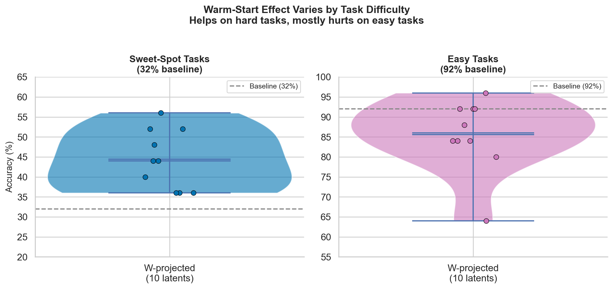

# Random Prefix Tokens Improve Small-Model Arithmetic via Trajectory Perturbation

**Devansh** | March 2026 | Work in Progress

---

## TL;DR

Prepending **random embedding-scale tokens** to the input of Qwen3-4B (Q4) improves arithmetic accuracy by up to **+28 percentage points** (32% to 60%) on chain-of-thought tasks. The direction of the tokens doesn't matter — only their presence. The effect is **non-monotonic**: 2 random tokens is optimal (60%), while 8 tokens drops back to 44%. The mechanism is **trajectory perturbation**: random prefixes shift the model from a "formal presentation" mode into an "exploratory computation" mode, trading structured output for actual calculation.

---

## Key Finding

| Condition | Accuracy | Change |
|-----------|----------|--------|
| Baseline (no prefix) | 32.0% | -- |
| Zero embedding (8 tokens) | 36.0% | +4pp |
| Mean embedding (8 identical) | 36.0% | +4pp |
| Random noise (1 token) | 42.7% | +10.7pp |
| **Random noise (2 tokens)** | **60.0%** | **+28pp** |
| Random noise (8 tokens) | 44.0% | +12pp |
| W-projected latent (8 tokens) | 44.4% | +12.4pp |

**Random noise and W-projected latents are statistically indistinguishable** (Mann-Whitney p = 1.0). Direction carries no signal. The dose-response is **non-monotonic** — 2 tokens is optimal, and more tokens actually degrades performance back toward 44%.

---

## Direction Changes WHICH Tasks, Not HOW MANY

At the 2-token sweet spot, all 3 random directions solve exactly the same number of tasks (13/22 sensitive tasks, std=0.00) but solve **different task subsets**. This "equalization" is the paper's headline finding.

Strict categorization (across ALL conditions):
- **2 always-solved** tasks (correct everywhere)
- **1 never-solved** task (nest_008, answer=7278)
- **22 sensitive** tasks (perturbation-dependent)
- **Full oracle**: 24/25 = 96% (only nest_008 truly unsolvable)
- **Oracle from 3 random 2-tok directions**: 21/22 = 95.5% of sensitive tasks

---

## Mechanism: Trajectory Perturbation

We propose **trajectory perturbation** as the primary mechanism. Evidence:

### What we tested

| Experiment | Result | Implication |
|-----------|--------|-------------|
| Zero embedding (8 tokens) | +4pp | Embedding *values* matter, not just sequence extension |
| Mean embedding (8 identical) | +4pp | Token diversity within prefix doesn't help for identical tokens |
| Random noise (1 token) | +10.7pp | Immediate effect from a single token |
| Random noise (2 tokens) | +28pp | **Non-monotonic peak** — 2 tokens is optimal |
| Random noise (8 tokens) | +12pp | Random = W-projected (p = 1.0) |
| No-think mode (any prefix) | +0pp | Chain-of-thought is the mediating mechanism |
| Easy tasks (92% baseline) | -7pp | Effect reverses on tasks the model already solves well |

### How it works

**Recovery pattern** (baseline wrong, prefix correct):
- Without prefix: model enters "formal presentation mode" — structured LaTeX, enumerated steps, truncates before computing
- With prefix: model shifts to "stream-of-consciousness computation" — informal, but actually performs arithmetic

**Regression pattern** (baseline correct, prefix wrong):
- Without prefix: efficient structured computation, finishes within token budget
- With prefix: exploratory rambling, exhausts the 1024-token limit before reaching an answer

The effect is mediated by **token budget**: correct answers average ~60s of generation, while wrong answers consistently hit the max_new_tokens ceiling (~80s = 1024 tokens). The prefix shifts output *policy*, not reasoning *quality*.

---

## Dose-Response: Non-Monotonic Optimum

The relationship between prefix token count and accuracy is **non-monotonic**:

| Tokens | Accuracy | Change vs baseline |
|--------|----------|-------------------|
| 0 | 32.0% | -- |
| 1 | 42.7% | +10.7pp |
| **2** | **60.0%** | **+28pp** |
| 8 | 44.4% | +12.4pp |

Two random tokens is the sweet spot. Adding more tokens actually *hurts* — 8 tokens drops back to 44%, likely because longer random prefixes induce excessive exploratory behavior that exhausts the token budget. The 2-token result showed **zero variance** across 3 independent random vectors (all exactly 15/25 correct).

---

## Force-Think Decomposition

The perturbation effect has two components:
- **Think-mode gating (+8pp)**: Any perturbation activates Qwen3's think mode (16% → 100%)
- **Noise beyond think (+20pp)**: Random noise contributes 2.5x more than think mode alone

| Condition | Think Rate | Accuracy |
|-----------|-----------|----------|
| Baseline | 16% | 32% |
| Force-think (no noise) | 100% | 40% |
| 2-tok random noise | 100% | 60% |

## Difficulty Dependence

The effect is **difficulty-dependent** and acts as a **policy switch**, not a generic intelligence boost:

- **Tiny answers (≤10)**: 0% → 75% at 2-tok (largest improvement!)
- **Medium answers (101-1000)**: 57% → 86% at 2-tok
- **Large answers (1001-5000)**: 100% → 78% at 2-tok (**regression** = overthinking)
- **Huge answers (>5000)**: 0% → 25% at 2-tok (modest)

This is consistent with **stochastic resonance**: noise helps when the system is near a threshold, but hurts when it's already performing well.

---

## Setup

- **Model**: Qwen3-4B (Q4 quantized), local inference
- **Tasks**: Nested arithmetic expressions (e.g., `(45 + 23) * 17 - 89`)
- **Prefix**: Random embeddings at model's native RMS scale (0.022), injected as soft prompt tokens before the input
- **Decoding**: Greedy (temperature = 0), thinking mode enabled (chain-of-thought)
- **Token budget**: max_new_tokens = 1024
- **Sample size**: 25 tasks, 3-10 random prefix vectors per condition

---

## Limitations

- **Single model**: Only tested on Qwen3-4B. Effect may not generalize to other architectures.
- **Single domain**: Only arithmetic tasks. Unclear if this extends to reasoning, coding, or language tasks.
- **Small n**: 25 tasks is insufficient for strong statistical claims. Need n=100+ for publication.
- **No attention analysis**: Mechanism is inferred from outputs, not from probing internal representations.
- **Greedy decoding**: Results may differ with sampling-based generation.

## Ongoing Work

1. **Within-prefix diversity test** — Does repeating one vector 8x match 8 distinct vectors?
2. **Attention masking** — If masking the prefix positions eliminates the effect, attention routing is confirmed
3. **Suffix position** — Does placing tokens *after* the prompt have the same effect?
4. **Token budget sweep** — Does increasing max_new_tokens to 2048/4096 eliminate regressions?
5. **Multi-model validation** — Llama-3.2-3B, Phi-3-mini, Gemma-2-2B
6. **Larger task sets** — Scale to n=100+ for statistical power

---

## Related Work

- **Shi et al. (2025)** — "Meaningless Tokens, Meaningful Gains" (arXiv:2510.01032). Closest prior work: repeated punctuation tokens (`/`, `?`) improve reasoning by 1-5% via MLP activation redistribution. Our work studies the continuous embedding-space regime, finding much larger effects (+28pp), direction independence, equalization, and deterministic chaos — phenomena not observed in discrete token space.
- **Goyal et al. (2024)** — "Think before you speak: Training Language Models With Pause Tokens" (ICLR 2024). Requires *training* with pause tokens; our effect uses *untrained* random embeddings at inference time.
- **London & Nagarajan (2025)** — NeurIPS. Proves mathematically that extra tokens increase transformer expressivity.
- **Li et al. (2025)** — Quasi-Lyapunov Exponent for LLMs. Formal chaos analysis in transformer layers.
- **Xiao et al. (2024)** — Attention Sinks. Documents attention sink phenomenon in first tokens.

**Positioning**: Shi et al. establish that prefix token perturbations help reasoning; we reveal the structure of the continuous perturbation landscape, demonstrating mode gating, oracle efficiency, and task-specific resonance.

---

## Figures

All figures generated from experiment data. Source: `experiments/create_figures.py`

| Figure | Description |
|--------|-------------|
| [Fig 1](experiments/figures/fig1_condition_comparison.png) | Accuracy across all prefix conditions |
| [Fig 2](experiments/figures/fig2_task_heatmap.png) | Per-task correctness heatmap |
| [Fig 3](experiments/figures/fig3_error_redistribution.png) | Error redistribution analysis |
| [Fig 4](experiments/figures/fig4_dose_response.png) | Token count dose-response |
| [Fig 5](experiments/figures/fig5_generation_time.png) | Generation time vs correctness |
| [Fig 6](experiments/figures/fig6_cross_difficulty.png) | Cross-difficulty comparison |
| [Fig 7](experiments/figures/fig7_mechanism_summary.png) | Mechanism evidence summary |

---

*Code and data: [github.com/dl1683/Latent-Space-Reasoning](https://github.com/dl1683/Latent-Space-Reasoning)*
